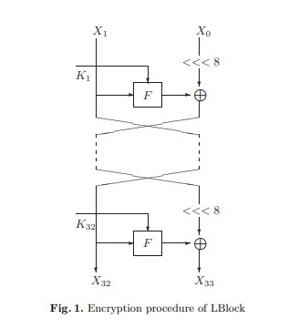
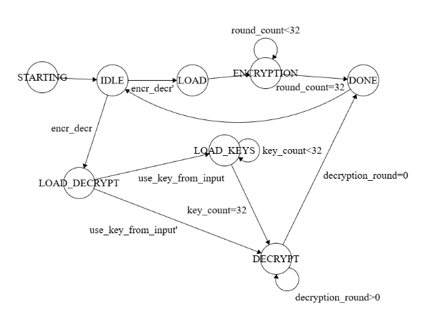
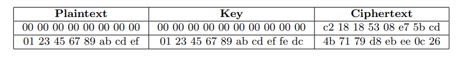
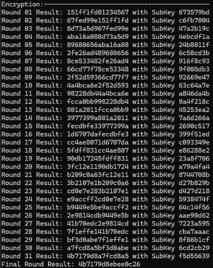
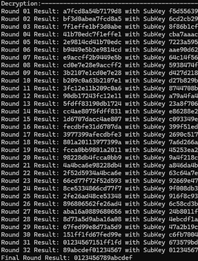
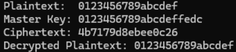
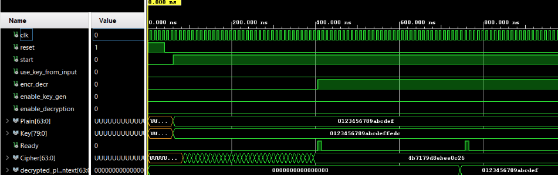
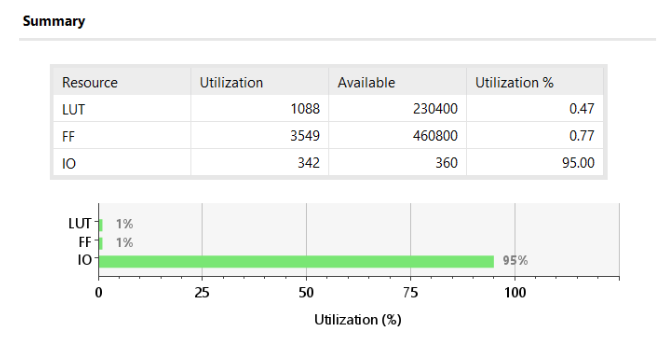
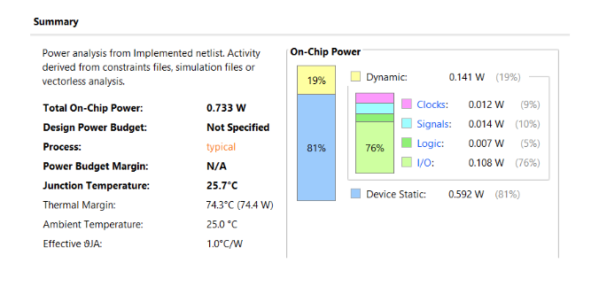

# LBlock Lightweight Cipher: Hardware Implementation

*This project was developed collaboratively from Vasileios Andreikos and Maria Ioanna Aisopou as part of our academic coursework. We divided the design modules and integrated the final datapath and control logic.*

## Project Overview

This is a collaborative academic project where we implemented the **LBlock** lightweight block cipher in hardware using **VHDL**. It is designed for resource-constrained environments like RFID technology and IoT devices. These applications demand low power consumption and minimal hardware area due to limited computational power.

The algorithm is a variant of the **Feistel structure** consisting of 32 rounds. Its block size is 64 bits and the Master Key is 80 bits.

Our hardware design supports both **Encryption** and **Decryption** and was simulated and verified using Xilinx Vivado on the **Xilinx Zynq UltraScale+(xczu7ev-ffvc1156-2-e**).

**Key Tools Used:**
* **RTL Design:** VHDL
* **Synthesis, Implementation, & Simulation:** Xilinx Vivado
* **Reference Model:** C

## Architecture

The design was implemented using a **top-down approach**. We split all functions into different modules, verified them separately, and then merged them to form the full architecture. The Encryption and Decryption processes share the same hardware modules to minimize the device's logic footprint.

Its core components are the **Round Function F** which combines non-linear Confusion and linear Diffusion layers and the **Key Sceduling** which generates unique 32-bit subkeys for each round through cyclical shifts and substitutions.

We designed a Finite State Machine (FSM) to control the modes of the design, allowing for loading inputs, encrypting, and decrypting separately.

## Verification

We verified our results against the official test vectors provided in the original LBlock algorithm paper, as shown below:

To verify the intermediate results between rounds and to assist with debugging, we also wrote a software reference model of the LBlock algorithm in **C**.

**C Model Outputs:**
* **Encryption Results:**
  
  
* **Decryption Results:**
  
  
* **Final Results:**
  
  

**Hardware Simulation:**
The RTL was simulated to ensure the waveforms perfectly matched the expected outputs from our C model.

* **Vivado Waveform for Encryption & Decryption:**
  

## Implementation Results

After synthesis and implementation on the target FPGA, we extracted the following performance metrics:

* **Utilization:**
  
  

* **Power Consumption:**
  
  

**Conclusion:** The post-implementation reports demonstrate that the design consumes a very small amount of the device's logical resources and has a dynamic power consumption of only 19% of the total on-chip power, validating its "lightweight" nature.
